# Analisis & Prediksi Timbunan Sampah di Indonesia

[](https://www.kaggle.com/code/faisaldinobahtiar/analisis-prediksi-timbulan-sampah-dengan-ai)
[](https://www.python.org/)
[](https://scikit-learn.org/)
[](https://www.tensorflow.org/)
[](https://xgboost.ai/)

---

## 📌 Tentang Repositori Ini

Repositori ini mendokumentasikan analisis data eksploratif, pemodelan prediktif multi-algoritma (*Machine Learning*, *Deep Learning*, dan *Time Series Forecasting*) untuk estimasi timbunan sampah di Indonesia yang sebelumnya telah dipublikasikan di **Kaggle**:
🔗 **Kaggle Notebook**: [Analisis & Prediksi Timbulan Sampah dengan AI](https://www.kaggle.com/code/faisaldinobahtiar/analisis-prediksi-timbulan-sampah-dengan-ai)

Repository ini kini diarsipkan dan dirapikan di GitHub agar dapat diakses, direproduksi, dan dimanfaatkan untuk studi kebijakan pengelolaan lingkungan hidup di Indonesia.

---

## 📖 Ringkasan Proyek

Masalah timbunan sampah merupakan salah satu tantangan lingkungan terbesar di Indonesia. Volume sampah harian dan tahunan yang terus meningkat di tingkat kabupaten/kota membutuhkan estimasi yang akurat guna mendukung perencanaan kapasitas Tempat Pemrosesan Akhir (TPA) dan alokasi fasilitas daur ulang.

Proyek ini bertujuan untuk:
1. **Menganalisis distribusi dan konsentrasi timbunan sampah** (harian & tahunan) di berbagai provinsi dan kabupaten/kota di Indonesia.
2. **Melakukan segmentasi wilayah (*Clustering Analysis*)** menggunakan **K-Means** untuk mengelompokkan daerah dengan karakteristik produksi sampah serupa.
3. **Membangun dan membandingkan berbagai arsitektur model AI/ML**:
   - Linear Regression & Polynomial Features
   - Support Vector Regressor (SVR)
   - Random Forest Regressor & Gradient Boosting Regressor
   - Extreme Gradient Boosting (**XGBoost**) dengan Hyperparameter Tuning (GridSearchCV)
   - **Stacking Regressor** (Ensemble Multi-Model)
   - Deep Learning: **LSTM (Long Short-Term Memory)**
4. **Melakukan peramalan tren deret waktu (*Time Series Forecasting*)** menggunakan model **ARIMA** lengkap dengan analisis diagnostik ACF/PACF.

---

## 📊 Dataset & Variabel

Dataset bersumber dari **Sistem Informasi Pengelolaan Sampah Nasional (SIPSN) - Kementerian Lingkungan Hidup dan Kehutanan (KLHK)**:
- **File**: `data/Data_Timbulan_Sampah_SIPSN_KLHK.xlsx`

### Variabel Utama:
| No | Nama Kolom | Tipe Data | Deskripsi |
|---|---|---|---|
| 1 | `Tahun` | Numerik | Tahun pencatatan data timbulan sampah |
| 2 | `Provinsi` | Kategorikal | Nama provinsi lokasi kabupaten/kota |
| 3 | `Kabupaten/Kota` | Kategorikal | Nama kabupaten atau kota administratif |
| 4 | `Timbulan Sampah Harian (ton)` | Numerik | Estimasi volume sampah harian yang dihasilkan (ton/hari) |
| 5 | `Timbulan Sampah Tahunan (ton)` | Numerik | **Target Utama**: Estimasi total volume sampah per tahun (ton/tahun) |

---

## 🔬 Metodologi & Alur Pipeline

```mermaid
flowchart LR
    A["Data Ingestion (Excel SIPSN)"] --> B["Header & Data Cleaning"]
    B --> C["Feature Engineering & Log Transform"]
    C --> D["EDA & K-Means Clustering"]
    D --> E["PCA Dimensionality Reduction"]
    E --> F["Multi-Model Training (ML, Ensemble, LSTM)"]
    F --> G["Hyperparameter Tuning (GridSearchCV)"]
    G --> H["Model Evaluation & Time Series (ARIMA)"]
```



### 1. Data Cleaning & Feature Engineering
- Penataan ulang multi-index header dari format mentah dokumen SIPSN KLHK.
- Pembersihan string dan konversi nilai ke tipe `float64`.
- **Feature Engineering**:
  - `Rasio_Harian_Tahunan`: Rasio perbandingan beban timbulan harian terhadap tahunan.
  - `Log_Timbulan_Tahunan`: Transformasi logaritmik $\log(1 + x)$ untuk menstabilkan varians dan menangani *skewness* data ekstrem.
- One-Hot Encoding pada fitur wilayah (`Provinsi`).
- Standardisasi fitur numerik menggunakan **StandardScaler**.
- Reduksi dimensi menggunakan **PCA (Principal Component Analysis)** untuk menangkap varians data utama.

### 2. Segmentasi Wilayah (K-Means Clustering)
- Melakukan pengelompokan wilayah administratif ke dalam beberapa klaster beban sampah berdasarkan volume produksi sampah harian dan tahunan.
- Memberikan visualisasi klaster wilayah prioritas penanganan sampah untuk KLHK dan pemerintah daerah.

### 3. Pemodelan Machine Learning & Deep Learning
- **Baseline Models**: Linear Regression, Polynomial Regression, SVR.
- **Tree Ensembles**: Random Forest Regressor, Gradient Boosting Regressor, dan XGBoost.
- **Hyperparameter Optimization**: Mengoptimalkan parameter XGBoost (`n_estimators`, `learning_rate`, `max_depth`, `subsample`, `colsample_bytree`) via GridSearchCV dengan K-Fold Cross-Validation.
- **Stacking Regressor**: Menggabungkan prediksi model-model terbaik ke dalam metamodel untuk meningkatkan akurasi generalisasi.
- **Deep Learning (LSTM)**: Arsitektur recurrent neural network (Sequential LSTM + Dropout + Dense layers) untuk memodelkan ketergantungan sekuensial produksi sampah.

### 4. Time Series Forecasting (ARIMA)
- Agregasi data time series tahunan level nasional.
- Pemeriksaan autocorrelation via **Plot ACF** (*Autocorrelation Function*) dan **PACF** (*Partial Autocorrelation Function*).
- Pemodelan **ARIMA** untuk memproyeksikan estimasi timbulan sampah beberapa periode ke depan.

---

## 📈 Evaluasi Model

Performa setiap model dievaluasi secara komprehensif menggunakan metrik:
- **MAE (Mean Absolute Error)**: Rata-rata selisih absolut antara prediksi dan realisasi timbulan sampah (ton).
- **MSE (Mean Squared Error)**: Rata-rata kuadrat kesalahan prediksi.
- **$R^2$ Score (Koefisien Determinasi)**: Mengukur seberapa baik variasi data timbulan sampah dapat dijelaskan oleh model AI.
- **Cross-Validation Score**: Memastikan model tidak mengalami *overfitting* pada data latih.

---

## 📁 Struktur Repositori

```text
Analisis-Prediksi-Timbunan-Sampah/
│
├── data/
│   └── Data_Timbulan_Sampah_SIPSN_KLHK.xlsx              # Dataset resmi SIPSN KLHK
├── analisis-prediksi-timbulan-sampah-dengan-ai.ipynb     # Jupyter Notebook interaktif
├── main.py                                               # Script Python standalone
├── requirements.txt                                      # Dependensi library
├── .gitignore                                            # Konfigurasi Git ignore
└── README.md                                             # Dokumentasi lengkap proyek
```

---

## 💻 Panduan Menjalankan Proyek

### 1. Clone Repositori
```bash
git clone https://github.com/vizca808/Analisis-Prediksi-Timbunan-Sampah.git
cd Analisis-Prediksi-Timbunan-Sampah
```

### 2. Setup Virtual Environment (Opsional)
```bash
python -m venv venv
# Windows:
venv\Scripts\activate
# Linux/macOS:
source venv/bin/activate
```

### 3. Install Dependensi
```bash
pip install -r requirements.txt
```

### 4. Jalankan Analisis
- **Via Jupyter Notebook**:
  ```bash
  jupyter notebook analisis-prediksi-timbulan-sampah-dengan-ai.ipynb
  ```
- **Via Script CLI Langsung**:
  ```bash
  python main.py
  ```

---

## 👤 Author

- **Faisal Dino Bahtiar**
- Kaggle: [@faisaldinobahtiar](https://www.kaggle.com/faisaldinobahtiar)
- GitHub: [@vizca808](https://github.com/vizca808)
